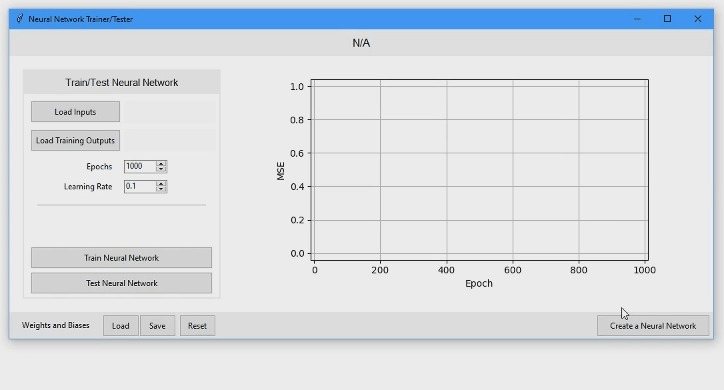

# Neural Network Trainer GUI
Easily set up a multi-layer neural network (MLP) to train on your excel datasets.
<p align="center">
    
</p>

## Motivation
Have an easy to use application to train the MNIST dataset of hand-written digits.

## Features
* Train a neural network
* Test a neural network and export the output as an excel file
* Save and load (or reset) a neural networks weights and biases to be available for later training or testing
* Display the Mean Squared Error (MSE) of the neural network while in the training phase
* Select epochs and the learning rate for the neural network to gain more control on what are the ideal training settings

## Installation
Requires: **Python 3.7** or above<br>

```pip install --no-cache-dir -r requirements.txt```

## How to use

Run Source code: ```python main.py```<br><br>
Convert to executable (.exe):
1. ```pyinstaller -w --hidden-import tkinter --exclude-module PySide2 --exclude-module PyQt5 --add-data "FeedforwardNeuralNetwork.py;." main.py```
1. Run *"main/main.exe"*

## Additional Info
The neural network is trained with the sigmoid activation function and uses the mean squared error to determine its performance on the dataset.

Project Start: 20.09.2020 <sub>(DD.MM.YYYY)</sub><br>
Project End: 22.09.2020 <sub>(DD.MM.YYYY)</sub><br><br>
Time spent: 06:30 <sub>(HH:MM)</sub>